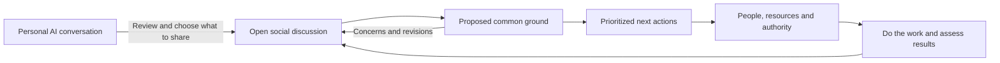

# Unite: a conversation that becomes collective work

26 September 2026. Revised product and societal proposal following the founder's rejection of the form-based prototype. Research and recommendations by Codex; all prototype engineering assigned to Claude Opus 5.5. This document supersedes the earlier proposal's **product experience**, while retaining its evidence, funding research and institutional-accountability work as background. Proposed mechanisms below are design hypotheses, not demonstrated outcomes.

**The experience should start with people talking.** You arrive, see a conversation about a life you recognize, contribute a thought or speak privately with an AI interviewer. You meet people with overlapping hopes and different constraints. Together you draft something you could support, see what remains unresolved, and immediately identify useful work. A person can begin with “I want more time with my children,” without knowing how to write a policy proposal.

The social product and the long-term economic vision are connected but distinct. Unite should be useful to someone who rejects its founder's preferred future. If its AI secretly steers people toward one economic system, it cannot credibly host open deliberation about that system.

## What the Anthropic study actually did

The study that appears to match the request is **80,508 interviews**, rather than 60,000: self-selected Claude users in **159 countries and 70 languages**, interviewed during a week in December 2025. It combined common questions with adaptive follow-ups, then used classifiers and human review to analyze themes and select de-identified quotations. It studies participants' hopes and experiences; it is not a representative vote of humanity or evidence of consensus about a future economy. [Anthropic: What 81,000 people want from AI](https://www.anthropic.com/features/81k-interviews)

The appendix clarifies that 112,846 interviews were received and 80,508 passed the study's quality filter; some earnest partial interviews remained. It explicitly discusses opt-in selection, ambiguous labels, question-order effects and dropout. For Unite, rotate or test question ordering, record who did not reach each question, and distinguish an omitted concern from an absence of concern. [Methods and limitations appendix](https://cdn.sanity.io/files/4zrzovbb/website/99156863ed4a812569fe00a2adfb1c93f7e5a911.pdf)

Anthropic describes three stages: researchers set the aims and refine the guide; an interviewer responds to each person's answers; researchers validate and interpret the resulting analysis. The transferable idea is **a consistent research purpose with a flexible conversation**, not an unrestricted chatbot producing a flattering summary. [About Anthropic Interviewer](https://www.anthropic.com/about-anthropic-interviewer)

Unite's proposed interview asks one question at a time:

1. What is difficult in your life now?
2. What would an ordinary good day look like?
3. What would that change make possible for you and others?
4. What must we preserve, and whose needs might conflict with yours?
5. What could you contribute, and what support would you need?
6. What evidence or experience might change your mind?

People can skip, correct, stop, or use ordinary public discussion instead. The AI offers a short expression of what it understood. **The person edits and chooses what to publish.** Private interview material must not quietly become public training examples, political profiles or room summaries. A live service needs explicit retention choices, deletion handling and provider terms; “private from other participants” is not “never processed by a provider.”

At scale, analysis should retain multiple themes per person, uncertainty and counterexamples. Validate translated meanings with speakers, check summaries against originals, and sample omissions as well as successful summaries. Recruit people who do not use AI through trusted local partners and assisted participation. Huge sample size does not repair systematic exclusion.

## Social psychology: make the rewarding action useful

| Research | What it supports | Product hypothesis to test |
|---|---|---|
| Brady and colleagues combined observational Twitter research with experiments and found that social feedback and perceived norms can reinforce expressed moral outrage. [Original study, university record](https://collaborate.princeton.edu/en/publications/how-social-learning-amplifies-moral-outrage-expression-in-online-/) | Visible rewards help shape what people express. Expression is not a direct measure of private emotion. | Reward accurate understanding, a useful question, a checked source and completed work. Avoid public popularity contests and escalating notifications. |
| Rathje and colleagues found that references to political out-groups strongly predicted sharing in their analyzed political social-media data. [PNAS](https://www.pnas.org/doi/full/10.1073/pnas.2024292118) | Engagement can select for antagonistic content; this observational relationship is not proof of every platform's causal effect. | Do not rank by outrage, reaction velocity or time spent. Explain why a conversation is shown and give people controls. |
| A 2026 Nature paper reports a seven-week 2023 X experiment: turning on the algorithm affected some political attitudes and following behavior, while switching it off did not symmetrically reverse those effects. Polarization and party identity did not significantly change. [Original study](https://www.nature.com/articles/s41586-026-10098-2) | Effects depend on the platform, intervention, history and outcome measured. | Chronological feeds are a transparent starting point, not a scientifically established cure for division. Evaluate Unite's actual effects. |
| Tessler and colleagues studied AI-generated common-ground statements with 5,734 participants, including a UK virtual citizens' assembly. Participants preferred AI statements on several measured qualities. [Science](https://doi.org/10.1126/science.adq2852) | AI can assist bounded deliberation; the experiment does not establish global legitimacy or long-term governance quality. | Make summaries proposed, sourced, editable and challengeable. Measure whether people recognize their own views, especially dissenting views. |

These findings inform design; they do not prove the proposed product will work. Anger can communicate real injustice. Moderation should address harassment, threats, doxxing and repeated disruption without treating calm phrasing as evidence of truth or filtering out forceful criticism of power.

The desired reasons to return are social connection, being understood, learning something useful, and seeing a contribution matter. Offer small rooms and continuity of relationships; acknowledge people who unblock work; show outcome updates; provide a natural stopping point. Avoid streaks, infinite scroll, artificial urgency, simulated participants, and rewards for recruiting a faction. These are explicit product choices, not claims that all engagement mechanics are inherently harmful.

Measure constructive participation, not merely minutes online: whether a participant can fairly describe another view; whether an objection changes a proposal; whether quieter participants stay; how often people correct AI summaries; whether work delivers the promised benefit; and whether people feel free to leave. Pair retention with participant-reported value. A lively argument that never improves anyone's life is not success.

## The new interaction loop

Two existing products are especially relevant to the revised brief. Stanford's online deliberation platform organizes small video groups with speaking queues, agendas and automated moderation; its practitioners explicitly design for equitable opportunities to speak. That suggests a future facilitated-room mode alongside Unite's everyday feed. [Stanford platform](https://deliberation.stanford.edu/tools-resources/online-deliberation-platform)

Remesh's documented live workflow lets a moderator ask prepared questions, inspect incoming responses and add follow-ups during the session. That is a useful precedent for responsive large-group inquiry, although its moderator-led research format is different from an open social community. [Remesh live moderation](https://help.remesh.ai/moderate-a-live-conversation)

Unite's proposed contribution is the continuity between private reflection, an ongoing social community, a revisable shared statement and work people actually undertake. None of those components needs to be claimed as a new invention; the combination and people's experience need testing.

**Conversations.** A readable feed with room membership, posts, replies and explicit perspectives. Start with ordinary themes—work and time, care, places to live, shared institutions—while letting participants create questions later. A worldwide room can connect communities without flattening them into one conversation. Follow chosen topics rather than infer sensitive political identities from behavior. A future discovery system can suggest related experiences with an explanation and opt-out.

**A personal interviewer.** Private conversation helps people articulate experience; public conversation lets them question one another. An AI facilitator should ask, clarify, translate, find related contributions and propose summaries. It should not impersonate participants, decide whose values count, cast votes or advance institutional decisions. Expert questions need evidence and actual expert review; generated confidence is not expertise.

**Common ground.** A statement is a versioned proposal. People respond with support, a concern, or abstention; conditional support can become its own state in a later iteration. Every aggregate identifies the exact statement, respondent population, time window and denominator. Revision requires renewed endorsement. Show unrepresented people and unresolved issues alongside support. “Everyone who responded supported this” and “everyone affected agrees” are different claims.

[Polis's opinion groups](https://compdemocracy.org/opinion-groups/) offer a precedent for seeing agreement across differing response patterns. Evaluate integration once participation is sufficient, rather than manufacturing clusters from a few demonstration users. A global single score would conceal disagreements about who bears costs. A shared aspiration—care should be accessible—does not settle delivery, taxes or employment terms.

**Act next.** Any discussion can suggest a small next action immediately: gather evidence, meet a group, prototype a tool, cost an option, run a community experiment, ask an institution to adopt a proposal. Agreement need not be unanimous to explore a reversible possibility. A coercive public decision requires a legitimate procedure and protections for affected people. If a group cannot agree, present alternatives, obtain missing information or run parallel experiments; don't use an AI rewrite to make disagreement disappear.

Live conversation should coexist with asynchronous participation. A visible decision window allows people in other time zones, with caring responsibilities or intermittent connectivity to respond. The people currently online should not gain automatic power over everyone else.

### Immediate prioritization, without pretending priorities are objective

First identify rights, safety, access, affected people and dependencies. A popular action cannot erase those questions. Then compare expected benefit, urgency, effort and uncertainty; keep estimates and the people who supplied them visible. Use a simple disclosed heuristic in the prototype and allow different orderings. It is a discussion aid, not a universal social-welfare function.

For consequential allocation, show several viable portfolios under a real resource constraint. Include prevention and maintenance, which dramatic new ideas can crowd out. Reserve capacity for urgent harm and underrepresented needs. Explain trade-offs in words: a cheap survey may be ready to start; a more valuable care service may need safeguarding, trained workers and recurring finance. A quick win should not displace essential long-term work just because its effort estimate is small.

An action record should retain the originating statement version, objections, intended beneficiaries, first step, owner, resources, dependencies, check-in and test of success. Changes in the discussion should mark the action for review. Volunteering creates an offer, not an obligation; entering an institution's name does not secure its consent. Institutional proposals remain awaiting adoption until an authorized body actually acts.

## What a mature society using Unite could look like

The founder's suggestion—that everybody works through a huge governmental system—contains several separable ambitions: economic security, meaningful contribution, a say over society's priorities, and coordination beyond profit. **My recommendation is to pursue those outcomes without making one employer the condition of everyone's livelihood.** This is a normative design judgment, not a result established by the cited experiments.

Imagine a person whose essential care, education and basic security are guaranteed. They can choose paid work in a public service, worker cooperative, research team, community enterprise or other permitted organization. Care, study, disability, retirement and periods of rest do not exclude them from political voice or basic support. Residents help decide public priorities; workers help govern workplaces; affected communities can challenge harms. AI makes possibilities and constraints intelligible. Humans and democratically accountable institutions make binding choices.

This could become a large share of the economy without requiring everyone to be on one government's payroll. Private economic activity, public ownership and cooperative ownership are questions participants can choose among. Unite should expose trade-offs and let people dispute the founder's direction.

| Possible future | Everyday experience | Main attraction | Unresolved difficulty |
|---|---|---|---|
| Universal public-service economy with many democratic institutions | Livelihood guarantees and a broad choice of socially useful work; budgets set at appropriate local and wider levels | Connects collective priorities, security and contribution | Recurring fiscal capacity; poor management; labor shortages; coordination across institutions |
| One global public employer | A worldwide system matches people, resources and collectively chosen tasks | Strong redistribution and coordination in principle | Concentration of political and employment power; weak exit; cultural autonomy; information bottlenecks; constitutional legitimacy |
| Mixed economy with stronger public guarantees and cooperatives | Markets coexist with public services, worker ownership and democratic investment | Builds from familiar institutions and allows institutional diversity | Existing concentrations of wealth and power can persist; unequal influence may undermine guarantees |

All three need an account of scarce resources, unpopular essential work, investment, innovation, environmental limits and accountability. Voting does not create clinicians, energy or housing. AI lowering software costs does not establish that physical production is abundant or that universal guarantees finance themselves.

A single global employer especially needs independent courts, unions, media and opposition; income protections during disputes; protection against political retaliation; and meaningful choices over occupation and locality. The principle of freely chosen work is also reflected in Article 23 of the [Universal Declaration of Human Rights](https://www.un.org/en/node/124305). Public contribution should not mean compulsory labor or a social score used to determine basic rights.

Elinor Ostrom's work on governance with multiple centers of decision-making gives a useful way to question a simple market-versus-single-state binary. It does not establish that any particular global design is feasible. [Nobel lecture](https://www.nobelprize.org/prizes/economic-sciences/2009/ostrom/lecture/)

## A migration path from today's economy

The route should be voluntary where possible, democratically authorized where public powers are involved, measurable and revisable. These are conditional stages, not a forecast or timetable for humanity.

| Stage | What changes in the real world | Unite's role | Evidence needed before expanding |
|---|---|---|---|
| 1. Understand and connect | People express needs and discover collaborators | Interviews, open discourse, contested summaries, action proposals | People recognize their views; missing perspectives are recruited; no hidden steering |
| 2. Fund small useful work | Existing organizations pay for time-limited care, learning, repair or environmental projects | Match willing people to clearly scoped tasks; publish costs, conditions and results | Useful outcomes, fair access/pay, responsible delivery and sustainable operating costs |
| 3. Change existing spending | Municipalities and anchor institutions adopt participatory budgets and social-value procurement | Feed public deliberation into existing legal decisions; track responses and contracts | Actual adoption, service quality, distributional impact and independent scrutiny |
| 4. Grow democratic ownership | Workers/communities form cooperatives; suitable enterprises convert through lawful negotiated arrangements; public institutions expand where chosen | Compare ownership models and help prepare feasible proposals | Financial viability, meaningful worker/community voice, protection of users and minority interests |
| 5. Broaden guarantees | Democracies consider public employment options, essential services, income protections and shorter working time | Compare policy packages, capacity constraints, funding and observed pilots | Country-specific fiscal/distributional modeling, legislative authority, inflation/supply checks and evaluation |
| 6. Coordinate across borders | Institutions negotiate shared standards, public goods, redistribution and labor/environmental safeguards | Connect deliberation across places and expose who benefits, pays and decides | Treaties or other legitimate agreements; local autonomy; equitable financing and enforceable rights |

Partial precedents help identify mechanisms rather than prove the end state. Preston uses community wealth building and procurement, and its current social-value policy links tender evaluation to monitored delivery. This is a route through existing expenditure, not evidence that the whole economy can be reorganized by software. [Preston's procurement policy](https://www.preston.gov.uk/article/12847/Social-value-in-procurement)

MONDRAGON's stated cooperative principles include democratic organization and the sovereignty of labor. It offers an existing model to study when considering worker governance, while remaining an organization operating in a broader market economy. It is not a global public employer. [MONDRAGON's own account](https://www.mondragon-corporation.com/en/about-us/)

India's official MGNREGA description provides a bounded public-employment precedent: a guarantee of at least 100 days per financial year to rural households whose adult members volunteer for unskilled manual work. Household, geography, work-type and time boundaries matter. This should not be described as a universal worldwide job guarantee. [Government scheme description](https://nrega.dord.gov.in/MGNREGA_new/home_nrega_new.aspx)

Finland's 2017–18 basic-income experiment reported better perceived economic security and wellbeing with small employment effects. Its specific population and setting do not establish effects or affordability of universal implementation. It is useful when comparing security delivered through income with security delivered through employment. [Official results](https://valtioneuvosto.fi/en/-/1271139/perustulokokeilun-tulokset-tyollisyysvaikutukset-vahaisia-toimeentulo-ja-psyykkinen-terveys-koettiin-paremmaksi)

Existing governments remain responsible for binding policy until legitimate constitutional processes change that. Start with institutions willing to publish a remit, a response date and reasons for accepting or rejecting recommendations. Participation cannot replace elections by accumulating app accounts. Wider cooperation should grow because it delivers value and earns authorization, not because Unite gradually acquires exclusive control of public discourse.

## Expertise, incentives and platform governance

Experts should join specific questions: what would a service cost; which intervention has evidence; what capacity exists; who might be harmed? Commission competing analyses where the stakes justify it, publish uncertainty and interests, and distinguish empirical claims from value judgments. Lived experience and specialist knowledge answer different questions. Experts help determine feasible means; they don't automatically get more votes on whose lives matter.

Appoint accountable moderators through each community's governance, with clear reasons and appeals. Allow vigorous disagreement about capitalism, socialism, state power or Unite itself. Stop harassment and manipulation without outsourcing political legitimacy to a toxicity score. Formal decision processes need eligibility and anti-capture rules distinct from the open conversation layer. Local-demo sessions are not verified humans.

Keep hosting, software implementation and political authority separable. Multiple clients and operators should exchange portable, versioned discussion/decision/action records; users should be able to leave without losing their contributions. Federation also needs moderation, consent and deletion semantics, not just a common file format. Neither a developer, donor nor one standards organization should own the sole route to participation. The new local prototype tests experience, not this eventual decentralized architecture.

Public-benefit funding, memberships, grants and institutional service contracts are more compatible hypotheses than advertising optimized for attention. Publish donors and conflicts. An institution paying for a process cannot silently choose its outcome. Pay participants and essential moderators where needed; don't build a public economy on unpaid work by people who can least afford it.

## What to build and learn next

The implementation target is a local application with real updates between connected browser tabs, public posts/replies, an opt-in actual Claude conversation, human-reviewed common-ground drafts, current stances, action prioritization and an interactive comparison of societal futures. Fictional sample content is labeled. Private interviews stay outside public events and exports. See [the v4 implementation report](../../prototype-v4/IMPLEMENTATION.md) for what was actually delivered and tested.

This is still an English-interface local prototype. A public pilot needs a provider API and service account, authentication appropriate to its scope, durable storage with deletion and backups, moderation/reporting/appeal, translation and accessible low-bandwidth/assisted routes, operational monitoring and independent review. Genuine global participation needs local relationships and recruitment as well as these capabilities. The interview model's language ability alone does not make the service accessible worldwide.

The founder reports roughly **US$10 or less** in credits for the earlier prototype; that billing was not independently audited. Continue inexpensive AI-assisted software iteration. The earlier optional $12,000 learning-cycle budget allocates only $100 to implementation credits, $150 to hosting and $750 to targeted human review; the balance concerns people and real-world experiments. It is not a prerequisite to improve this demo. **Live interviewing has a separate variable inference cost.** Measure actual calls and set caps; don't infer that thousands of ongoing interviews cost $10 because initial coding did.

A first learning cycle should answer three questions before expanding: Do people prefer social entry, personal AI entry or both? Does a reviewed synthesis help them understand one another without hiding conflict? Does the action queue lead to a useful completed task? Recruit across viewpoints and access needs, observe misunderstandings, let participants help redesign the process, and revise the societal scenarios as disagreements emerge.

No organization has been contacted, no participant recruited, no grant submitted, and no public authority or economic transition secured by this work.
